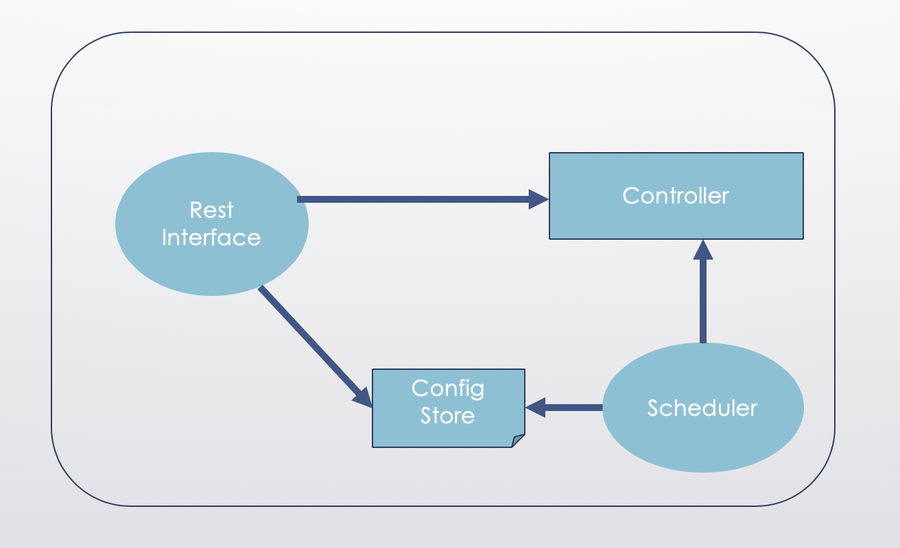
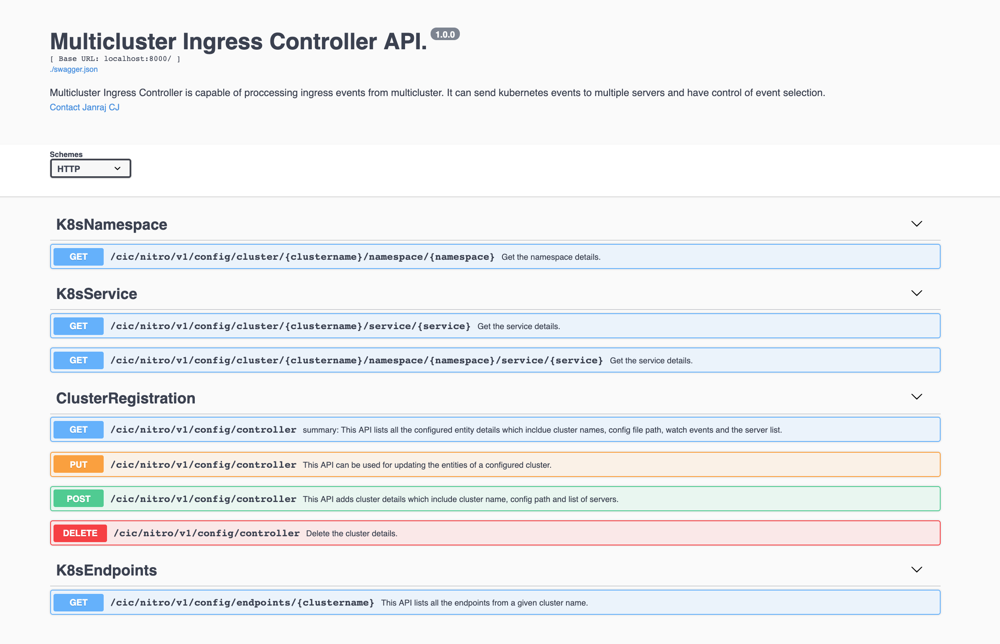

# Multicluster-Ingress-Controller

Multicluster-Ingress-Controller is a Go library for building Kubernetes ingress controllers that need to watch resources in multiple clusters. Multicluster-Ingress-Controller is accesible via REST API Interface. It is capable of delivering same events to multiple recipients. It is also capable of delivering specific kubernetes events to the registered servers.  


## Table of Contents

- [Introduction](#introduction)
- [Architecture](#architecture)
- [How it Works](#how-it-works)
- [Getting Started](#getting-started)
- [Configuration](#configuration)
- [API Reference](#api-reference)

## Introduction

Hybrid and multicloud architectures are becoming predominant. Every customers are moving to hybrid and multi cluster architecture for running thier  applications. Hybrid and Multicluster are very complex in nature. Kubernetes is standardizing the way clouds are operated: the same workflow can be used to manage resources in any cloud, whether public or private or even in on prem. However managing workloads, exposing the application to external world (Route) across all these multiple clusters is still a challenge. Every cluster should have ingress controller. Managing its life cycle all these ingress controllers will be another challege. There are several platform orchastrators which allows to manage all clusters from one place. There tools to handle multiclsuer schedule, autoscale, upgrade etc. Multicluster Ingress COntroller helps the admin to manage all the cluster from one Ingress controller which runs at one place (Inside k8s cluster/outside) and listen for all teh ingress events and configure the  appropriate ingress devices.

## Architecture


       <details>
       <summary>**Rest Interface**</summary>
	    Rest Interface has two components one is API exposed to user and another is openAPI documentation. OpenAPI documentation allows the user to understand teh usage of API and an options to try out the Rest API. 
       </details>
       <details>
       <summary>**Controller**</summary>
	    Controller has two module, first one is go client and another is dispatcher. Kubernetes Go client is being used for getting the events from kubernetes cluster. Dispatcer sends out the filtered events to the list of servers who are interested.
       </details>
       <details>
       <summary>**Config Store**</summary>
	    This persitant volume store in kubernetes. Which keeps all the rest input. 
       </details>
       <details>
       <summary>**Scheduler**</summary>
	    This module required when controller restarts. Scheduler restart the controller for which it takes the input from the COnfig store.
       </details>

## How it Works

Multicluster-Ingress-Controller is a rest based go library which exposes few Rest API. User can register access the events from multiple cluster which can be send to multiple server.  


## Getting Started

```
	1) Download/Clone the Multicluster-Ingress-Controller.
		
	2) Perform "make run" from build folder.
		This starts the Multicluster Ingress Controller

	3) Access the Rest Interface via http://localhost:8000/swagger/
```
	
## Configuration

There is no specific configuratiosn required at initial phase. However right now user has to keep all the cluster kube config file where the controller is running. We are working on token based solution which will remove this dependancy.

## API reference

Following are Sample Rest API exposed by Multicluster Ingress controller.




